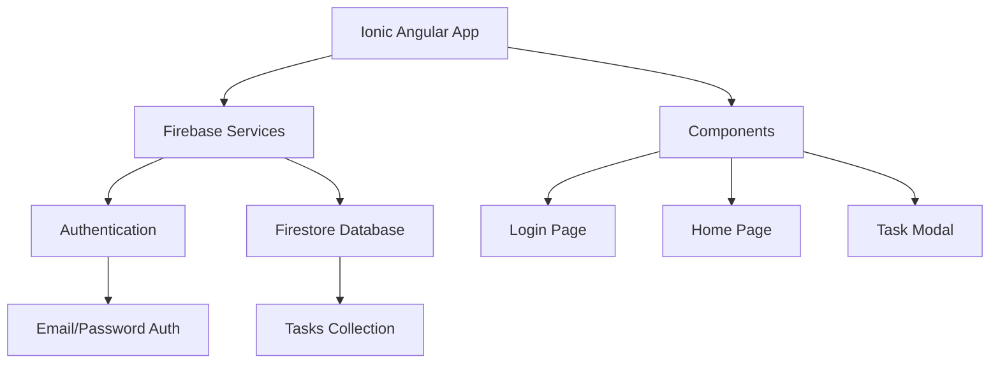
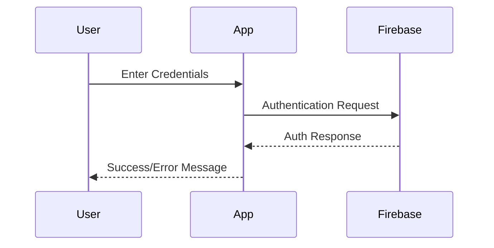
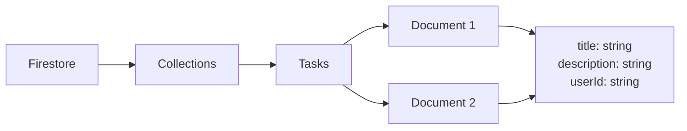

# Firebase Lab

## Agenda

1. [Project Setup and Firebase Configuration](#1-project-setup-and-firebase-configuration)
2. [Authentication Implementation](#2-authentication-implementation)
3. [Firestore Integration](#3-firestore-integration)
4. [Route Protection and Guards](#4-route-protection-and-guards)
5. [Task Management Implementation](#5-task-management-implementation)

## 1. Project Setup and Firebase Configuration

### Concept Introduction: Project Architecture

The lab demonstrates building a task management application using Ionic Angular with Firebase services. The architecture combines Firebase Authentication for user management and Firestore for data storage.



### Procedure

1. Create Firebase Project:
   - Navigate to [Firebase Console](https://console.firebase.google.com)
   - Click "Add Project"
   - Name it "firebase-ionic-project".
   - Disable Google Analytics when prompted.
   - Under Build, add the Authentication service. Select Email/Password.
   - Under Build, add the Firestore Database service. Start in Test Mode.
   - Click on project overview and register a web app in your Firebase project called ionic-web-app.

2. Configure Firebase Services:
   ```bash
   # Create new Ionic standalone project
   ionic start w6-lab-firebase blank --type=angular

   # Install required tools
   npm install -g @angular/cli
   npm install -g firebase-tools

   # Login to Firebase
   firebase login

   # Install AngularFire
   ng add @angular/fire
   ```

3. Register Web App:
   - In Firebase Console, click "Project Overview"
   - Select "Web" (</>)
   - Register app as "ionic-web-app"
   - Copy the configuration object

### Configuration Example

```typescript
// src/environments/environment.ts
export const environment = {
  production: false,
  firebase: {
    apiKey: "your-api-key",
    authDomain: "your-auth-domain",
    projectId: "your-project-id",
    storageBucket: "your-storage-bucket",
    messagingSenderId: "your-messaging-sender-id",
    appId: "your-app-id"
  }
};
```

## 2. Authentication Implementation

### Concept Introduction: Firebase Authentication



### Generate Required Components

```bash
# Generate auth service
ionic g service auth --standalone

# Generate login page
ionic g page login --standalone
```

### Auth Service Implementation

```typescript
// src/app/services/auth.service.ts
import { Injectable } from '@angular/core';
import { Auth, createUserWithEmailAndPassword, signInWithEmailAndPassword } from '@angular/fire/auth';
import { Firestore, doc, setDoc } from '@angular/fire/firestore';

@Injectable({
  providedIn: 'root'
})
export class AuthService {
  constructor(
    private auth: Auth,
    private firestore: Firestore
  ) {}

  async register({ email, password }) {
    try {
      const userCredential = await createUserWithEmailAndPassword(
        this.auth,
        email,
        password
      );
      
      await setDoc(doc(this.firestore, `users/${userCredential.user.uid}`), {
        email
      });
      
      return userCredential;
    } catch (error) {
      throw error;
    }
  }

  login({ email, password }) {
    return signInWithEmailAndPassword(this.auth, email, password);
  }

  logout() {
    return this.auth.signOut();
  }
}
```

### Login Page Implementation

```typescript
// src/app/pages/login/login.page.ts
import { Component } from '@angular/core';
import { FormBuilder, FormGroup, Validators } from '@angular/forms';
import { Router } from '@angular/router';
import { AlertController } from '@ionic/angular';
import { AuthService } from '../../services/auth.service';

@Component({
  selector: 'app-login',
  templateUrl: './login.page.html',
  styleUrls: ['./login.page.scss'],
})
export class LoginPage {
  credentials: FormGroup;

  constructor(
    private fb: FormBuilder,
    private authService: AuthService,
    private alertController: AlertController,
    private router: Router
  ) {
    this.credentials = this.fb.group({
      email: ['', [Validators.required, Validators.email]],
      password: ['', [Validators.required, Validators.minLength(6)]]
    });
  }

  async register() {
    try {
      await this.authService.register(this.credentials.value);
      this.router.navigateByUrl('/home');
    } catch (error) {
      this.showAlert('Registration failed', error.message);
    }
  }

  async login() {
    try {
      await this.authService.login(this.credentials.value);
      this.router.navigateByUrl('/home');
    } catch (error) {
      this.showAlert('Login failed', error.message);
    }
  }

  private async showAlert(header: string, message: string) {
    const alert = await this.alertController.create({
      header,
      message,
      buttons: ['OK'],
    });
    await alert.present();
  }
}
```

## 3. Firestore Integration

### Concept Introduction: Firestore Database



### Task Service Implementation

```typescript
// src/app/services/tasks.service.ts
import { Injectable } from '@angular/core';
import { Firestore, collection, addDoc, query, where, getDocs, deleteDoc, updateDoc } from '@angular/fire/firestore';
import { Auth } from '@angular/fire/auth';

export interface Task {
  id?: string;
  title: string;
  description: string;
  userId: string;
}

@Injectable({
  providedIn: 'root'
})
export class TasksService {
  constructor(
    private firestore: Firestore,
    private auth: Auth
  ) {}

  async addTask(task: Task) {
    const userId = this.auth.currentUser?.uid;
    const tasksRef = collection(this.firestore, 'tasks');
    return addDoc(tasksRef, { ...task, userId });
  }

  async getTasks() {
    const userId = this.auth.currentUser?.uid;
    const tasksRef = collection(this.firestore, 'tasks');
    const q = query(tasksRef, where('userId', '==', userId));
    const querySnapshot = await getDocs(q);
    
    return querySnapshot.docs.map(doc => ({
      id: doc.id,
      ...doc.data()
    }));
  }

  // Additional CRUD operations...
}
```

[Continue with sections 4 and 5...]

### DIY Tasks

1. Implement password reset functionality using Firebase's `sendPasswordResetEmail` method.
2. Add a logout button to the home page header.
3. Create a task modal component for adding new tasks.
4. Implement task editing using the AlertController.
5. Add slide-to-delete functionality for tasks.

## Common Issues and Troubleshooting

1. Firebase Initialization Errors:
   - Check if environment variables are correctly configured
   - Ensure Firebase services are enabled in console

2. Authentication Errors:
   - Verify email/password requirements
   - Check Firebase console for auth settings

3. Firestore Permission Errors:
   - Review security rules
   - Verify user authentication state

## Additional Resources

- [Firebase Documentation](https://firebase.google.com/docs)
- [Ionic Framework Documentation](https://ionicframework.com/docs)
- [AngularFire Documentation](https://github.com/angular/angularfire)

---
End of Lab
